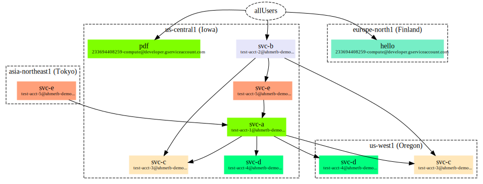

# cloudrun-iamviz

This tool visualizes call permissions between [Cloud Run fully managed][cr]
services.

[cr]: https://cloud.run/

Example:



## Installation

Install [`graphviz`](https://graphviz.org/download/) for your operating system.

Check out this repository and run:

```
go run .
```

## Notes

This project is still in development.

This is not an official Google project.
